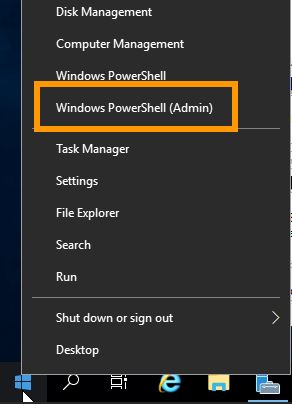

**Last updated 24th January 2023**

## Objective

Redundant Array of Independent Disks (RAID) is a utility that mitigates data loss on a server by replicating data across two or more disks.

The default RAID level for OVHcloud server installations is RAID 1, which doubles the space taken up by your data, effectively halving the useable disk space.

**This guide explains how to reconfigure the RAID of your Windows system if it needs to be rebuilt due to corruption or disk failure.**

## Requirements

- A Windows [dedicated server](https://www.ovhcloud.com/en-gb/bare-metal/) with a software RAID configuration
- Administrative access to the server via RDP

## Instructions

Establish a remote desktop (RDP) connection to your server.

Once logged in, right-click on the `Start Menu`{.action} button and open `Windows PowerShell (Admin)`{.action}.

{.thumbnail}

### Rebuilding the RAID

At the command prompt, open DiskPart:

```powershell
C:\Windows\system32> diskpart
```

Display all disks:

```
DISKPART> list disk

  Disk ###  Status         Size     Free     Dyn  Gpt
  --------  -------------  -------  -------  ---  ---
  Disk 0    Online          894 GB      0 B   *     
  Disk 1    Online          894 GB   894 GB       
  Disk M1   Missing           0  B      0 B   *    
```

In this example, it is assumed that `Disk 1` is a replacement drive for the defective `Disk M1` which has been [physically removed](https://docs.ovh.com/gb/en/dedicated/disk-replacement/).


> [!primary]
>
> The following code examples are for the purpose of illustration only. You will need to adjust the instructions according to your actual configuration by replacing the values in the commands with your disk and volume identifiers.
>


Select the new disk:

```
DISKPART> select disk 1

Disk 1 is now the selected disk.
```

Convert `Disk 1` to a "dynamic" disk:

```
DISKPART> convert dynamic

DiskPart successfully converted the selected disk to dynamic format.
```

Display all volumes:

```
DISKPART> list volume

  Volume ###  Ltr  Label        Fs     Type        Size     Status     Info
  ----------  ---  -----------  -----  ----------  -------  ---------  --------
  Volume 0     C   Windows      NTFS   Mirror       893 GB  Failed Rd  Boot
  Volume 1         EFI          FAT32  Partition    350 MB  Healthy    Hidden
  Volume 2         EFI          FAT32  Partition    350 MB  Failed Rd  System
  Volume 3     D                       CD-ROM          0 B  No Media
```

This output shows which volumes are in the `Failed` status. Select the volume in question and then use the `break` command:

```
DISKPART> select volume 2
Volume 2 is the selected volume.
DISKPART> break disk=M1 nokeep
DiskPart successfully broke the mirror volume.
```

**Repeat the above step** for each volume in the state `Failed`.

After this operation, the status of the volume(s) should have changed to `Healthy`. You can verify this by listing all volumes again:

```
DISKPART> list volume

  Volume ###  Ltr  Label        Fs     Type        Size     Status     Info
  ----------  ---  -----------  -----  ----------  -------  ---------  --------
  Volume 0     C   Windows      NTFS   Simple       893 GB  Healthy    Boot
  Volume 1         EFI          FAT32  Partition    350 MB  Healthy    Hidden
  Volume 2         EFI          FAT32  Partition    350 MB  Healthy    System
  Volume 3     D                       CD-ROM          0 B  No Media
```

The next step is to add the replacement disk (`Disk 1` in this example) as a `mirror`:

```
DISKPART> select volume 2
Volume 2 is the selected volume.
DISKPART> add disk=1
DiskPart succeeded in adding a mirror to the volume.
```

**Repeat this step** for each volume previously removed with the `break` command.

The RAID will then be automatically rebuilt. The volume state will be `Rebuild` during the process, which may take several hours depending on the data stored on the disk.

### Removing the replaced disk from the configuration

Enter the following commands to remove the old disk and close DiskPart:

```
DISKPART> select disk M1
Disk M1 is now the selected disk.
DISKPART> delete disk
DiskPart successfully deleted the missing disk.
DISKPART> exit
Leaving DiskPart...
```

If the replaced disk was the primary disk (`Disk 0`) of your server, an additional step is necessary.

In this case, enter the following commands to rewrite the Windows bootloader:


```powershell
bcdedit /set {default} device partition=c:
bcdedit /set {default} osdevice partition=c:
bcdedit /set {bootmgr} device partition=c:
```


## Go further

[Hot Swap – Hardware RAID](https://docs.ovh.com/gb/en/dedicated/hotswap-raid-hard/)

[Hot Swap – Software RAID](https://docs.ovh.com/gb/en/dedicated/hotswap-raid-soft/)

[Hardware RAID](https://docs.ovh.com/gb/en/dedicated/raid-hard/)

Join our community of users on <https://community.ovh.com/en/>.